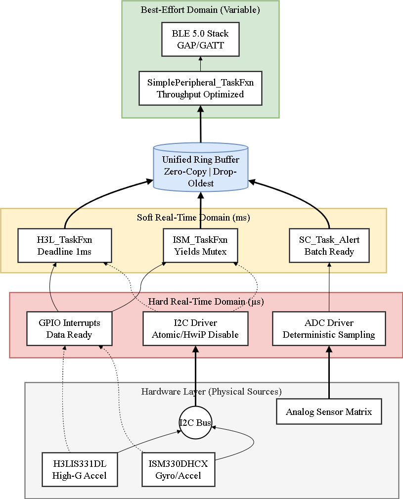
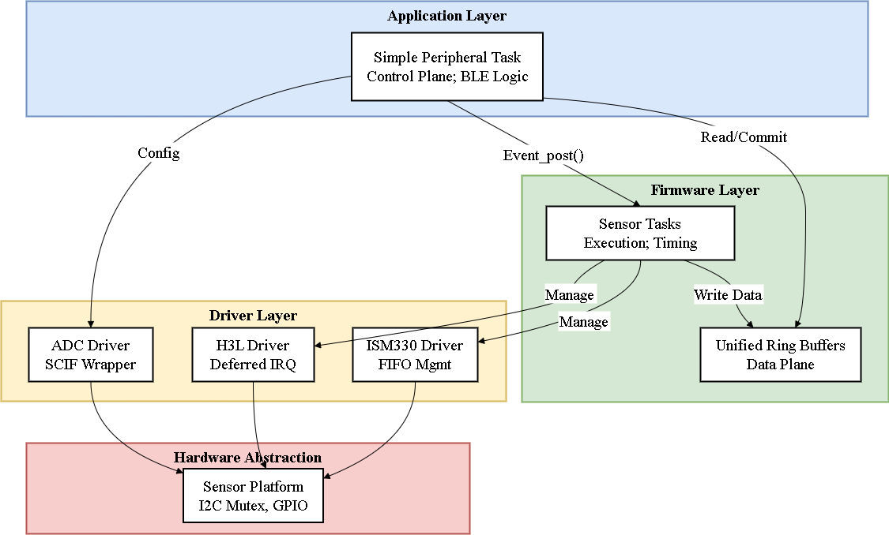

# High-Throughput Multi-Sensor BLE Platform

This repository contains the firmware implementation for a modular wireless sensor platform designed for sports telemetry. It runs on the **TI CC2652RB** (Cortex-M4F) using **TI-RTOS**.

##  Key Features
*   **High-Bandwidth BLE:** Sustains >520 kbps throughput using custom batching protocols.
*   **Real-Time Concurrency:** Prioritized RTOS tasks for simultaneous 1.6kHz Gyro, 1kHz Accel, and 34kHz ADC sampling.
*   **Zero-Copy Architecture:** Optimized Ring Buffer implementation with direct DMA access.
*   **Dual-Core Processing:** Offloads analog acquisition to the Sensor Controller Engine (SCE).

## Hardware Stack
*   **MCU:** Texas Instruments CC2652RB
*   **Sensors:** ISM330DHCX (6-DoF), H3LIS331DL (High-G), FSR Matrix.
*   **OS:** TI-RTOS (SimpleLink SDK v5.30)

## Project Structure
*   `/app`: Main BLE application logic and throughput orchestration.
*   `/drivers`: Custom sensor drivers.
*   `/middleware`: Lock-free unified ring buffer logic.
*   `/profiles` : Custom GATT profile for high-throughput streaming.
*   `/scif` : Sensor Controller source code and Studio project file (`.scp`).
*   `/vendor` : STMicroelectronics register abstraction libraries. 
*   `/tests` : Python validation scripts.

## System Architecture

## Build Instructions 
1.  Install Code Composer Studio (CCS) v12.0+ and SimpleLink CC13xx/CC26xx SDK v5.30.
2.  Import the `simple_peripheral` example.
3.  Copy **all folders** from this repository into the project root.

## Thesis
This code is part of my Master's Thesis: *"Development of a Modular Microsystem for Multi-Sensor Data Acquisition"*.
